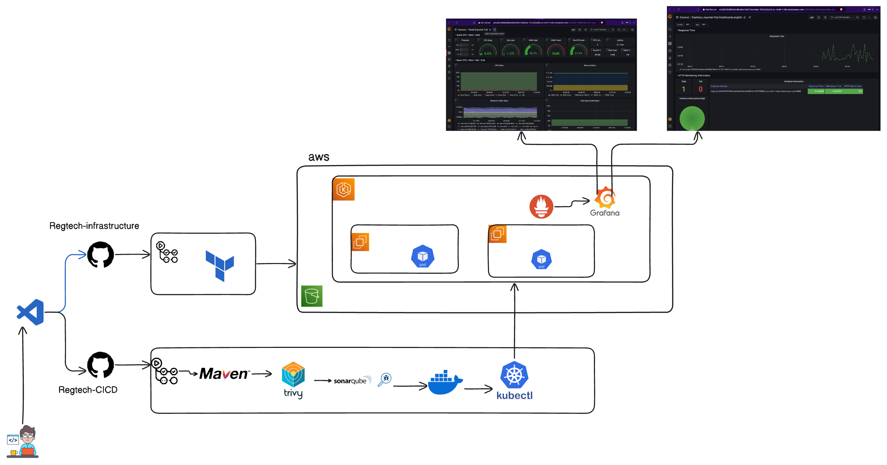

# regtech EKS infrastructure provisioned with Terraform 
# This can be deployed in two ways, from either a VM/PC or from Githubactions workflow

# Deploying from VM or PC

- `clone the reposiroty`
- `edit terraform files to your prefrence: like region, backend, number of nodes etc`


### Install AWS CLI 

As the first step, you need to install AWS CLI as we will use the AWS CLI (`aws configure`) command to connect Terraform with AWS in the next steps.

Follow the below link to Install AWS CLI.
```
https://docs.aws.amazon.com/cli/latest/userguide/getting-started-install.html
```

### Install Terraform

Next, Install Terraform using the below link.
```
https://developer.hashicorp.com/terraform/tutorials/aws-get-started/install-cli
```

### Connect Terraform with AWS

Its very easy to connect Terraform with AWS. Run `aws configure` command and provide the AWS Security credentials as shown in the video.

### Initialize Terraform

Clone the repository and Run `terraform init`. This will intialize the terraform environment for you and download the modules, providers and other configuration required.

### format and validate the terraform configurations

Run `terraform fmt`

Run `terraform validate`


### Optionally review the terraform configuration

Run `terraform plan` to see the configuration it creates when executed.

### Finally, Apply terraform configuation to create EKS cluster with VPC 

`terraform apply`

# Deploy from GitHub Actions workflow (recommended)

1. Fork the repository
2. Clone your forked repository
3. Create the following secrets in your GitHub repository:
   - `AWS_ACCESS_KEY_ID`
   - `AWS_SECRET_ACCESS_KEY`
4. Edit the Terraform files as needed if needed
5. run `terraform fmt`
6. run `terraform validate`
5. Commit and push your changes to the main branch
6. Go to the Actions tab in your GitHub repository
7. click on the "Regtech-Infrastructure" workflow

To do that click on Actions


Click on Regtech-Infrastructure you use the drop down to choose to plan, apply or destroy


you can have options


# on success plan, you goto same place and select apply and on sucesss you will get the image below


## Create Namespace and RBAC for application 
# Access cluster from any cli where AWScli is installed and configured to the account and region or you can use AWS cloudshell of the region.

1. confirm that your cluster is active 
    Run `aws eks describe-cluster --region <your region> --name <cluster-name> --query "cluster.status"`
2. to connect to cluster and carry out kubectl commands
    Run `aws eks update-kubeconfig --region <your region> --name <cluster-name>`
3. to enable access to the cluster
    Run 
    ```
    aws eks update-cluster-config \
    --region <your region> \
    --name <cluster-name> \
    --resources-vpc-config endpointPublicAccess=true,endpointPrivateAccess=true
    ```

# Create Namespace, Service Account, Role & Assign that role
    ```
    Run kubectl create ns <your-namespace>
    ```
# For the yaml codes below, copy and create the file.yml and Run with `kubectl apply -f file.yml`

# Creating Service Account


```yaml
apiVersion: v1
kind: ServiceAccount
metadata:
  name: <name-of-app>
  namespace: <your-namespace>
```

### Create Role 


```yaml
apiVersion: rbac.authorization.k8s.io/v1
kind: Role
metadata:
  name: app-role
  namespace: <your-namespace>
rules:
  - apiGroups:
        - ""
        - apps
        - autoscaling
        - batch
        - extensions
        - policy
        - rbac.authorization.k8s.io
    resources:
      - pods
      - secrets
      - componentstatuses
      - configmaps
      - daemonsets
      - deployments
      - events
      - endpoints
      - horizontalpodautoscalers
      - ingress
      - jobs
      - limitranges
      - namespaces
      - nodes
      - pods
      - persistentvolumes
      - persistentvolumeclaims
      - resourcequotas
      - replicasets
      - replicationcontrollers
      - serviceaccounts
      - services
    verbs: ["get", "list", "watch", "create", "update", "patch", "delete"]
```

### Bind the role to service account


```yaml
apiVersion: rbac.authorization.k8s.io/v1
kind: RoleBinding
metadata:
  name: app-rolebinding
  namespace: <your-namespace> 
roleRef:
  apiGroup: rbac.authorization.k8s.io
  kind: Role
  name: app-role 
subjects:
- namespace: webapps 
  kind: ServiceAccount
  name: <name-of-app> 
```

## Now the infrastructre and name space is ready to recieve the app!!!
## We heard over to the CICD pipleline to deploy a sample game app to this infrastructure.


# RegTech CI/CD Setup Guide

## Step 1: Fork and Clone Repository
1. Fork this repository to your GitHub account.
2. Clone the forked repository to your local machine.

## Step 2: Create Self-Hosted Runner
1. Go to the "Settings" tab of your forked repository.
2. Navigate to "Actions" in the left sidebar.
3. Select "Runners" and follow the prompts to create a runner on your chosen VM.

## Step 3: Install Dependencies on Runner
Install the following on your self-hosted runner:

1. Docker
2. AWS CLI
   - Run `aws configure` to set up AWS access
3. Trivy 
   - Run 
     ```
     sudo apt-get install wget apt-transport-https gnupg lsb-release
     wget -qO - https://aquasecurity.github.io/trivy-repo/deb/public.key | sudo apt-key add -
     echo deb https://aquasecurity.github.io/trivy-repo/deb $(lsb_release -sc) main | sudo tee -a /etc/apt/sources.list.d/trivy.list
     sudo apt-get update
     sudo apt-get install trivy
     ```
4. SonarQube
   - Run SonarQube server in a container:
     ```
     docker run -d -p 9000:9000 sonarqube:lts-community
     ```
   - Ensure TCP port 9000 is open on your VM

## Step 4: Set Up Docker Repository
Create a Docker repository and update the `CICD-pipeline.yml` file with your `username/repository:tag`.

## Step 5: Configure Repository Secrets
Add the following secrets to your repository:

- `DOCKERHUB_USERNAME`: Your DockerHub username
- `DOCKERHUB_TOKEN`: Generate this from DockerHub settings
- `SONAR_TOKEN`: SonarQube authentication token
- `SONAR_HOST_URL`: `http://<runner-public-ip>:9000`
- `KUBE_CONFIG`: Base64-encoded Kubernetes config (obtain from EKS cluster through the cli)
  ```
  base64 ~/.kube/config
  ```
## Step 5: Commit and push to trigger the pipeline.
this should build and deploy to the cluster and can be accessed from the cluster loadbalancer:8080 or nodeip:nodeport if load balancer isnt up yet.
you can check again with `kubectl get svc -n (your-namespace)`


# Key Decisions and Rationale

During the development of this infrastructure setup, several key decisions were made:

1. Use of Terraform: We chose Terraform for infrastructure provisioning due to its declarative syntax, multi-cloud support, and ability to version control infrastructure code. This allows for consistent, repeatable deployments and easier collaboration among team members.

2. EKS for Kubernetes: Amazon EKS was selected as the Kubernetes platform because it's a managed service, reducing operational overhead while providing seamless integration with other AWS services. This allows any team to focus more on application development rather than cluster management.

3. GitHub Actions for CI/CD: i implemented GitHub Actions for the CI/CD pipeline due to its tight integration with the source code repository, reducing context switching for developers. It also provides a wide range of pre-built actions and the flexibility to use self-hosted runners.

4. Self-hosted runner: We opted for a self-hosted runner to have more control over the build environment and to potentially reduce costs compared to GitHub-hosted runners. This also allows us to install and configure specific tools needed for our pipeline.

5. Security scanning with Trivy: Integrating Trivy into the pipeline ensures that it catch vulnerabilities in the container images early in the development process, enhancing the overall security of our deployments.

6. Code quality checks with SonarQube: By incorporating SonarQube analysis, i maintained high code quality standards and catch potential issues before they make it to production.

7. Namespace and RBAC setup: i implemented detailed RBAC rules to ensure proper access control within our Kubernetes cluster, following the principle of least privilege.

8. Flexible deployment options: By providing both local and GitHub Actions-based deployment methods, i accommodated different team preferences and use cases, enhancing the overall flexibility of my setup.

These decisions were made to create a robust, secure, and maintainable infrastructure that balances developer productivity with operational excellence.